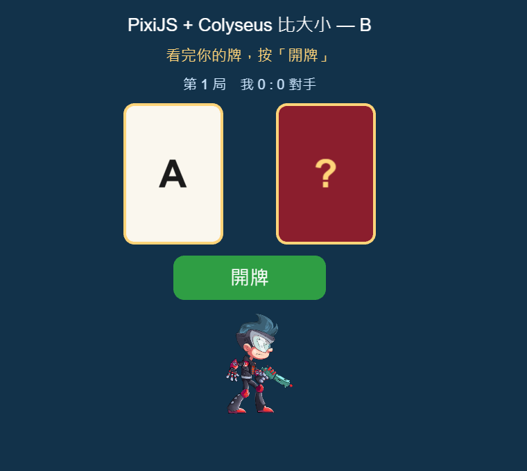
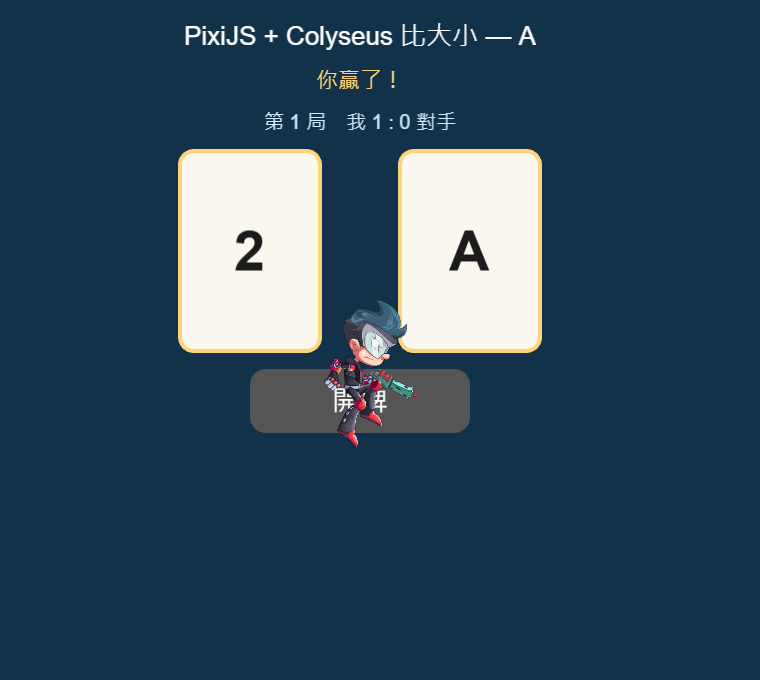

# PixiJS + Colyseus 卡牌比大小：最小範例

這是一個技術驗證用的範例專案，目的是實測研究筆記 [跨平台手遊-技術選型與成本-研究筆記](跨平台手遊-技術選型與成本-研究筆記.md) 第十一節建議的套件組合，確認它們能不能一起正常運作。

**遊戲規則**：兩位玩家各拿到一張牌（1～13）。雙方都按下「開牌」後，由伺服器比大小、計分，1.5 秒後自動發下一局。




## 使用的套件

| 用途 | 套件 | 驗證時的版本 |
|---|---|---|
| 畫面 | pixi.js | 8.22.0 |
| 排版 | @pixi/layout | 3.2.1 |
| 按鈕 | @pixi/ui | 2.4.1 |
| 骨骼動畫 | @esotericsoftware/spine-pixi-v8 | 4.3.13 |
| 補間動畫（翻牌） | gsap | 3.15.0 |
| 音效 | @pixi/sound | 6.0.1 |
| 前端流程 | xstate | 5.33.2 |
| 連線（前端） | @colyseus/sdk | 0.18.5 |
| 連線（伺服器） | @colyseus/core / @colyseus/ws-transport / @colyseus/schema | 0.18.18 / 0.18.4 / 5.0.36 |
| 包成 App | @capacitor/core、@capacitor/android | 8.5.2 |
| 開發與測試 | vite、tsx、@playwright/test | 8.3.3、4.23.15、1.63.0 |

## 架構重點

- **伺服器說了算**：發牌、判定勝負、計分都在 `server/CardRoom.ts` 完成。前端只負責顯示結果，以及送出「我準備好了」。
- **私密手牌**：每位玩家的牌用 Colyseus 的 `.view()` 標記，再把自己的資料加進該玩家的 `StateView`。這樣對手的牌**完全不會傳到你的瀏覽器**，不只是畫面上看不到而已。
- **作弊攔截**：伺服器會拒絕以下三種請求，並記錄在 log 裡：
  - `claim_win`：玩家自己宣稱獲勝
  - `set_card`：玩家自己改牌
  - 重複送出 `ready`
- **減少動態效果**：系統開啟「減少動態效果」（`prefers-reduced-motion`）時，翻牌直接換成新的牌面，不播動畫。

## AI agent 開發

- 開發規則和已知的坑寫在 [AGENTS.md](AGENTS.md)。`CLAUDE.md` 會引用它，所以 Claude Code 也會讀到。
- `.claude/skills/` 收錄了 Colyseus、PixiJS、GSAP 的官方 agent 技能，以及 Capawesome 的 Capacitor 技能，全部對應本專案使用的版本。本專案也自己寫了兩個技能：`pixi-addons` 涵蓋 @pixi/ui、@pixi/layout、Spine、@pixi/sound；`xstate-flow` 涵蓋 XState v5 的前端流程。另外收錄了 `prototype-fast`（快速原型流程），以及從 awesome-gamedev、Claude-Code-Game-Studios 改寫的 `card-game-design`（卡牌遊戲設計、手感、手機 UI）。
- 上架前要逐項確認 [docs/release-checklist.md](docs/release-checklist.md)。來源與更新方式見 [.claude/VENDORED-SKILLS.md](.claude/VENDORED-SKILLS.md)。

## 執行方式

```powershell
cd demos/pixi-colyseus-card
npm install
npx playwright install chromium-headless-shell   # 第一次跑測試才需要
npm run assets      # 下載 Spine 範例素材，並產生開牌音效（需要 Python）

# 視窗 1：伺服器
npm run server
# 視窗 2：前端開發伺服器
npm run dev
# 用瀏覽器開兩個分頁：http://localhost:5173/?name=A 和 http://localhost:5173/?name=B
```

自動化測試會開兩個看不見的瀏覽器，實際玩兩局。執行前，伺服器和前端都要先啟動：

```powershell
npm run test:e2e                                  # 測開發版（localhost:5173）
npm run build; npm run preview                    # 打包正式版，在 localhost:4173 提供
$env:BASE = "http://localhost:4173"; npm run test:e2e
```

產生 Android 專案：

```powershell
npm run build
npm run cap:android   # 只產生 android/ 資料夾；要打包成 APK，還需要 Java 和 Android SDK
```

## 驗證結果（2026-10-07，Windows 11、Node 24.13.0）

- 開發版連跑 3 次，正式版再跑 1 次：**每次 21 項檢查全部通過**。之後加入「減少動態效果」功能，檢查項目增加為 23 項；開發版連跑 3 次，每次也都全部通過。
- 檢查項目包含：
  - 私密手牌不會外洩
  - Spine、音效、排版、翻牌動畫、按鈕都正常
  - 三種作弊被拒絕
  - 兩局的勝負判定正確
  - xstate 流程依序轉換
  - 兩個頁面都沒有任何錯誤
- `npx cap add android` 和 `npx cap sync android` 都成功。**沒有打包出 APK**，因為驗證的機器上沒有 Java 和 Android SDK。

## 已知限制與注意事項

- **Spine 4.3 的 API 改名**：`AnimationState.getCurrent()` 已改成 `getTrack()`，網路上的舊範例照抄會出錯。
- **剛連上伺服器時，`room.state` 可能還沒收到完整資料**。第一次繪製畫面前要先檢查，不然會讀到空值而出錯。
- **連線網址**：預設連 `ws://<目前網址的主機>:2567`。裝進手機 App 時，要用 `?server=wss://...` 參數或修改程式，指定正式伺服器的位址。
- **檔案大小**：打包後的主程式約 974 KB（gzip 壓縮後 308 KB），之後要拆檔，讓首次載入更快。
- **安全性**：原本 `npm audit` 回報 16 個漏洞，都是 `colyseus` 整合套件附帶的登入功能套件造成的。改用 `@colyseus/core` 之後已降到 0 個。
- **Spine 授權**：這裡只拿官方範例素材來驗證。商業專案要另外購買 Spine 授權，見研究筆記第十四節。
